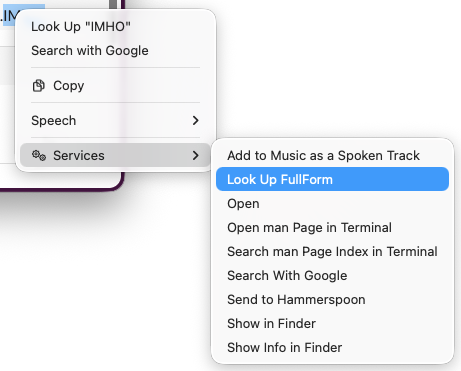
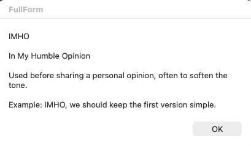

# FullForm


FullForm is a lightweight macOS selected-text lookup utility. Select a short form or internal term in Slack, TextEdit, or another macOS app, run the **Look Up FullForm** Quick Action, and see the locally stored full form in a dialog.

It is intentionally small: a Swift command-line tool, a JSON glossary, and a macOS Quick Action.

## Screenshots

Run FullForm from the macOS Services menu after selecting an acronym:



FullForm shows the matching entry in a native macOS dialog:



## Contents

- [Screenshots](#screenshots)
- [Install](#install)
- [Features](#features)
- [How It Works](#how-it-works)
- [Prerequisites](#prerequisites)
- [Build and Test](#build-and-test)
- [Local Manual Install](#local-manual-install)
- [Glossary Format](#glossary-format)
- [Verification Checklist](#verification-checklist)

## Install

Install with Homebrew:

```bash
brew tap su66uu/fullform https://github.com/su66uu/FullForm.git
brew trust --formula su66uu/fullform/fullform
brew install fullform
$(brew --prefix fullform)/bin/fullform install-service
```

This builds FullForm from source, installs the CLI, then installs the macOS Quick Action and sample glossary for your user account.

After installation, select text in any macOS app and run **Look Up FullForm** from the Services / Quick Actions menu.

To merge newly bundled glossary entries into your local glossary:

```bash
$(brew --prefix fullform)/bin/fullform update-glossary
```

This adds missing bundled entries, preserves your existing entries, and creates a backup before writing changes.

To remove the Quick Action:

```bash
$(brew --prefix fullform)/bin/fullform uninstall-service
```

This removes the macOS Quick Action and leaves your glossary file unchanged.

## Features

- **Selected-text lookup** through a macOS Quick Action.
- **Local glossary** stored as JSON under the user's Application Support directory.
- **Exact normalized matching** for predictable behavior.
- **macOS dialog output** using `osascript`, with stdout fallback if dialogs cannot be shown.
- **Overwrite-safe setup**: `install-service` only copies the sample glossary if the user does not already have one.

## How It Works

```text
Selected text in any macOS app
  -> Look Up FullForm Quick Action
  -> fullform lookup "<selected text>"
  -> ~/Library/Application Support/FullForm/fullform.json
  -> macOS dialog with the result
```

The Quick Action is intentionally thin. It only passes selected text to the CLI:

```bash
selected_text="$(cat)"

if [ -x /opt/homebrew/bin/fullform ]; then
  /opt/homebrew/bin/fullform lookup "$selected_text"
elif [ -x /usr/local/bin/fullform ]; then
  /usr/local/bin/fullform lookup "$selected_text"
else
  osascript -e 'display dialog "FullForm is not installed." buttons {"OK"} default button "OK"'
fi
```

All lookup behavior lives in the Swift code and is covered by unit tests.

## Prerequisites

- macOS
- Xcode or Swift toolchain with Swift Package Manager
- Automator / Quick Actions support

Check the Swift toolchain:

```bash
swift --version
```

## Build and Test

Build the debug target:

```bash
swift build
```

Run the test suite:

```bash
swift test
```

Run the CLI without installing it:

```bash
swift run fullform lookup IRL
```

Build the release binary:

```bash
swift build -c release
```

The release binary is produced at:

```text
.build/release/fullform
```

## Local Manual Install

For manual testing, install the release binary and sample glossary yourself.

```bash
swift build -c release
sudo install -m 755 .build/release/fullform /usr/local/bin/fullform
mkdir -p "$HOME/Library/Application Support/FullForm"
cp -n Resources/fullform.json "$HOME/Library/Application Support/FullForm/fullform.json"
```

Verify the CLI directly:

```bash
/usr/local/bin/fullform lookup IRL
/usr/local/bin/fullform lookup XYZ
```

Expected behavior:

- `IRL` shows the sample full form.
- `XYZ` shows a not-found message.

> [!NOTE]
> The CLI displays results using a macOS dialog. If the dialog cannot be shown, it prints the same message to stdout.

## Glossary Format

FullForm uses a JSON object keyed by normalized lookup term:

```json
{
  "IRL": {
    "fullForm": "In Real Life",
    "description": "Used to distinguish offline or in-person context from online discussion.",
    "example": "Let's discuss this IRL."
  }
}
```

Fields:

- `fullForm` is required.
- `description` is optional.
- `example` is optional.

The runtime glossary lives at:

```text
~/Library/Application Support/FullForm/fullform.json
```

### Lookup Rules

FullForm normalizes the selected text before lookup:

- trims leading and trailing whitespace
- removes common surrounding punctuation
- uppercases the lookup key
- treats the full selected string as one key

Examples:

```text
"irl" -> IRL
" IRL " -> IRL
"IRL." -> IRL
"Let's discuss IRL" -> LET'S DISCUSS IRL
```

> [!IMPORTANT]
> FullForm does not scan inside sentences. If you select `Let's discuss IRL`, it looks for the full key `LET'S DISCUSS IRL`, not `IRL`.

## Verification Checklist

Run these before handing off a build:

```bash
swift test
```

Manual checks:

- `fullform lookup IRL` opens a found-result dialog.
- `fullform lookup XYZ` opens a not-found dialog.
- **Look Up FullForm** works from selected text in TextEdit.
- Running `install-service` again does not overwrite an existing `~/Library/Application Support/FullForm/fullform.json`.
